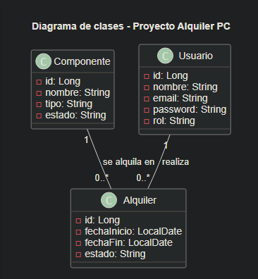

# Memoria Segunda Entrega

## 1. Introduccion
Esta segunda entrega corresponde a la fase de desarrollo e implementacion del proyecto `Alquiler PC`. El objetivo del sistema es permitir la gestion de componentes informaticos, usuarios y alquileres mediante una aplicacion web dividida en varias capas.

El proyecto se ha desarrollado con una arquitectura cliente-servidor sencilla, usando tecnologias web en el frontend, Spring Boot en el backend y MySQL para guardar la informacion.

## 2. Diseno definitivo del sistema
El sistema se ha planteado para cubrir la gestion de recursos de hardware dentro de un entorno de alquiler. La aplicacion se organiza en tres bloques principales:

- Interfaz de usuario para operaciones basicas.
- Backend REST para el procesamiento de peticiones.
- Base de datos relacional para el almacenamiento de la informacion.

En la version actual estan implementadas las operaciones principales sobre componentes, usuarios y alquileres, dejando la aplicacion lista para seguir ampliandose si fuera necesario.

## 3. Arquitectura software final
La arquitectura del proyecto sigue un modelo cliente-servidor con separacion por capas:

- Capa de presentacion:
  Archivos HTML, CSS y JavaScript situados en la carpeta `frontend/`.

- Capa de logica de negocio:
  Aplicacion Java con Spring Boot situada en `backend/backend-alquiler/`.

- Capa de acceso a datos:
  Repositorios JPA conectados a una base de datos MySQL.

### Flujo de funcionamiento
1. El usuario accede a la interfaz web.
2. El frontend lanza peticiones HTTP al backend.
3. El backend procesa la peticion mediante controladores y repositorios.
4. Los datos se guardan o consultan en MySQL.
5. La respuesta se devuelve al frontend en formato JSON.

## 4. Modelo de datos definitivo
El modelo de datos se basa en tres entidades principales:

### 4.1 Componente
Representa un recurso disponible para alquiler.

Campos:
- `id`
- `nombre`
- `tipo`
- `estado`

### 4.2 Usuario
Representa a la persona que utiliza el sistema.

Campos:
- `id`
- `nombre`
- `email`
- `password`
- `rol`

### 4.3 Alquiler
Representa el alquiler de un componente por parte de un usuario durante un periodo concreto.

Campos:
- `id`
- `fechaInicio`
- `fechaFin`
- `estado`
- `usuario`
- `componente`

### 4.4 Relaciones
- Un usuario puede tener varios alquileres.
- Un componente puede estar asociado a varios alquileres a lo largo del tiempo.
- Cada alquiler pertenece a un unico usuario y a un unico componente.

## 5. Diagramas UML actualizados
Se ha incluido un diagrama de clases editable en:



- `uml/diagrama-clases.puml`

Este diagrama representa las entidades principales del sistema y sus relaciones. Se ha utilizado como apoyo para entender mejor la estructura del proyecto.

## 6. Implementacion

### 6.1 Estructura del proyecto
La estructura general del proyecto es la siguiente:

```text
proyecto-alquiler-pc/
|- frontend/
|  |- index.html
|  |- login.html
|  |- app.js
|  |- Css.css
|- backend/
|  |- backend-alquiler/
|     |- src/main/java/com/proyecto/backend/
|     |- src/main/resources/
|     |- src/test/java/com/proyecto/backend/
|- database/
|  |- schema.sql
|  |- datos_prueba.sql
|- uml/
|  |- diagrama-clases.puml
|  |- UML.png
|- Guia.md
|- README.md
|- PRUEBAS.md
|- Evidencias.pdf
```

### 6.2 Desarrollo de las funcionalidades principales
Las funcionalidades que tiene la aplicacion actualmente son:

- Alta de componentes mediante formulario web.
- Consulta de componentes desde el frontend.
- Registro basico de usuarios.
- Login basico de usuarios.
- Alta y consulta de alquileres mediante endpoints REST.
- Separacion basica de funcionalidades por rol.
- Alquiler de componentes disponibles por parte del usuario.

### 6.3 Integracion entre capas
La conexion entre las distintas capas funciona de la siguiente manera:

- El frontend consume endpoints REST del backend.
- Los controladores reciben y responden peticiones HTTP.
- Los repositorios gestionan el acceso a la base de datos.
- Las entidades JPA representan las tablas del modelo relacional.

### 6.4 Gestion de usuarios y control de acceso
Se ha implementado una base funcional para los usuarios del sistema:

- Registro de usuario mediante endpoint `POST /api/auth/register`
- Login mediante endpoint `POST /api/auth/login`
- Listado de usuarios mediante endpoint `GET /api/auth/usuarios`
- Restriccion basica para que solo `ADMIN` pueda anadir componentes
- Restriccion basica para que solo `USER` pueda alquilar componentes

El control de acceso es basico y no incluye seguridad avanzada, cifrado de contrasenas ni sesiones protegidas. Se ha priorizado que la funcionalidad principal quede operativa y clara.

## 7. Base de datos

### 7.1 Relaciones y restricciones
Se han definido restricciones basicas para mantener la coherencia entre los datos:

- `nombre`, `tipo` y `estado` obligatorios en `Componente`
- `nombre`, `email`, `password` y `rol` obligatorios en `Usuario`
- `email` unico en `Usuario`
- `fecha_inicio`, `fecha_fin` y `estado` obligatorios en `Alquiler`
- Claves foraneas desde `Alquiler` hacia `Usuario` y `Componente`

### 7.2 Scripts incluidos
El proyecto incluye los siguientes scripts:

- `database/schema.sql`
- `database/datos_prueba.sql`

### 7.3 Datos de prueba
Los datos de prueba se han utilizado para comprobar:

- Componentes disponibles y alquilados
- Usuarios con distintos roles
- Alquileres activos y finalizados

## 8. Pruebas

### 8.1 Plan de pruebas
El plan de pruebas se ha recogido en el archivo:

- `PRUEBAS.md`

Incluye pruebas manuales sobre:
- Carga de componentes
- Alta de componente
- Validacion de formulario
- Login correcto
- Login incorrecto
- Alquiler de componente disponible con rol de usuario
- Restriccion de alta de componentes para usuarios no administradores
- Verificacion de datos en MySQL

### 8.2 Evidencias
Las evidencias de la aplicacion incluyen:

- Capturas del frontend funcionando
- Captura del login
- Captura de la base de datos con datos insertados
- Respuestas de endpoints probados

Las evidencias se adjuntan en el documento `Evidencias.pdf`.

### 8.3 Incidencias detectadas y soluciones aplicadas
Durante el desarrollo aparecieron varias incidencias:

- Problemas de codificacion de caracteres en el frontend
- Clases de usuarios y alquileres vacias en una fase inicial
- Ausencia de scripts SQL y de documentacion tecnica propia
- Problemas puntuales de conexion entre Spring Boot y MySQL
- Necesidad de ajustar la interfaz para diferenciar las acciones de `ADMIN` y `USER`

Para resolverlas se hicieron los siguientes cambios:

- Normalizacion de textos para evitar caracteres conflictivos
- Implementacion basica de entidades, repositorios y controladores
- Creacion de scripts de esquema y datos de prueba
- Incorporacion de documentacion de proyecto, pruebas y UML
- Revision de la configuracion del backend para la conexion con MySQL
- Separacion funcional de la interfaz segun el rol del usuario

## 9. Despliegue

### 9.1 Requisitos del entorno
- Java 17
- MySQL
- IDE compatible con Maven o Maven instalado
- Navegador web

### 9.2 Instrucciones de instalacion y ejecucion
1. Crear la base de datos ejecutando `database/schema.sql`.
2. Cargar datos iniciales con `database/datos_prueba.sql`.
3. Revisar la configuracion del archivo `application.properties`.
4. Iniciar el backend desde el IDE o con Maven.
5. Abrir `frontend/login.html` o `frontend/index.html`.

### 9.3 Configuracion necesaria
Archivo principal de configuracion:

- `backend/backend-alquiler/src/main/resources/application.properties`

Configuracion actual:
- URL: `jdbc:mysql://localhost:3306/alquiler_pc`
- Usuario: `root`
- Password: ninguna
- `spring.jpa.hibernate.ddl-auto=update`

## 10. Estado actual y mejoras futuras
El proyecto dispone ya de una base funcional suficiente para demostrar la conexion entre presentacion, logica de negocio y acceso a datos. La gestion de componentes esta operativa y la parte de usuarios y alquileres tambien funciona de forma basica.

Como mejoras futuras se plantean:

- Seguridad con Spring Security
- Cifrado de contrasenas
- Validaciones mas completas
- Mas pruebas automaticas y cobertura real
